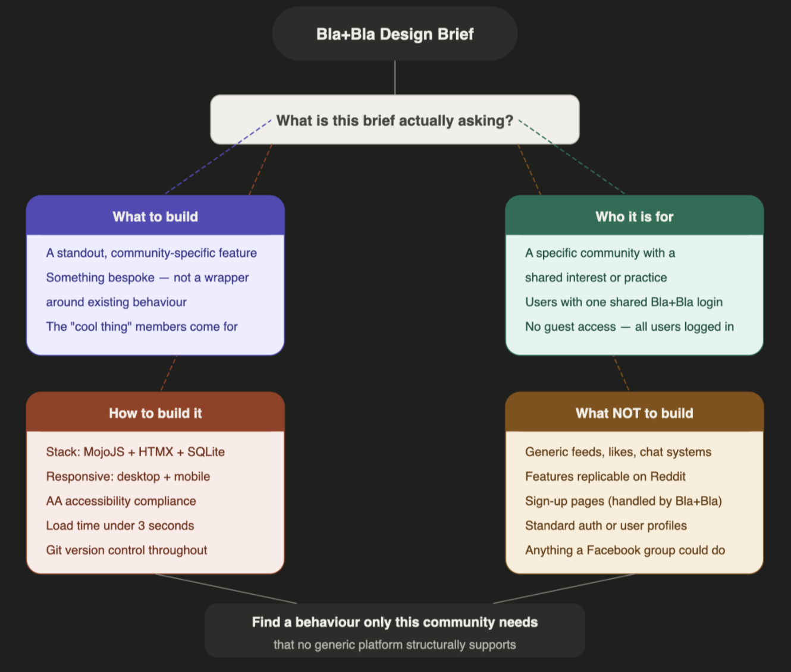
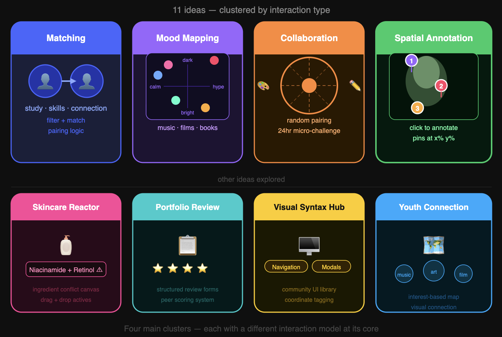

**The Bla+Bla brief initially appears open-ended, but its
constraint is actually quite strict:** do not build another
generic social media platform. The requirement is not to
recreate feeds, likes, or chat systems, but to identify a
community-specific behaviour that existing platforms fail to
support. The brief is less about features and more about
uncovering unmet needs — and crucially, the standout feature
must only make sense for a particular community. This became
the core filter for evaluating all ideas.

*Figure 1: Deconstructing the Bla+Bla brief — four constraint
layers that shaped how I evaluated every idea.*

---

## Reading the Brief as a Design Constraint

Most briefs tell you what to build. This one tells you what
not to build — and that is a harder, more useful instruction.

The Bla+Bla brief rules out feeds, likes, profiles, and chat.
It rules out features that would work just as well on Reddit.
It rules out anything that requires a community to already
exist before the feature is useful. What remains after those
eliminations is a very narrow target: one behaviour, for one
community, that only makes sense in this specific context.

That framing shifted how I approached ideation entirely. The
question was not "what would be useful?" but "what would be
useless everywhere except here?" That is a much harder
question — and it eliminated most ideas before they were
fully formed.

The four constraints I derived from the brief — community
specificity, non-generic interaction, technical feasibility,
and scope stability — are not equally weighted. The first
two are filters. The last two are constraints. An idea that
fails the first two is rejected. An idea that passes them
but fails the last two is deferred, not discarded. That
distinction mattered when evaluating Collab Roulette — a
genuinely novel idea that failed on scope stability alone,
not on community or interaction quality.

---

## Generating Ideas

Starting from that constraint, I generated 11 concepts
across different communities. Rather than listing all of
them, the ideas clustered into four categories:

**Matching and exchange concepts** — study buddy matcher,
skill swap board, youth connection map. Real communities,
but core interactions already exist on LinkedIn and Reddit.
Familiar patterns in new clothes.

**2D mood mapping concepts** — shared emotional maps for
music, films, or books, where users place items on a canvas
by mood or atmosphere. Genuinely novel across all three
variations.

**Creative collaboration concepts** — Collab Roulette,
randomly pairing two creatives for a 24-hour micro-challenge.
Exciting and original.

**Spatial annotation concepts** — Critique Canvas, a
click-to-annotate feedback layer for artwork. And a similar
idea applied to UI patterns for design students.

*Figure 2: All 11 ideas visualised by cluster — each
category has a different interaction model at its core.*

---

## Applying the Brief's Filter

Running all ideas through three criteria derived from the
brief eliminated most quickly:

- **Community specificity** — does it solve a real niche need?
- **Non-generic interaction** — not replicable on Reddit or Instagram
- **Technical feasibility** — fits the MojoJS, HTMX, SQLite stack

Matching concepts failed immediately — their interactions
are not community-specific enough. Mood mapping concepts
were genuinely novel but all depended on external APIs.
If Spotify rate-limits, if TMDB changes schema, the core
interaction breaks. That structural risk rules them out
for a prototype assessed on stability.

Three ideas survived: **Collab Roulette**, **VibeShelf**,
and **Critique Canvas**. The next post explains how we
chose between them — and why the decision came down to
scope stability, not creativity.

---

## Ambiguities and Open Questions

Even before narrowing to one idea, constraints were visible:

- Which communities have pain points existing platforms
**structurally** cannot solve — not just choose not to
- Whether the core interaction needs external dependencies
- Whether the feature is scoped for stability or requires
complex real-time logic

> The brief is not a checklist. It is a set of
**elimination criteria** — and most ideas fail them.