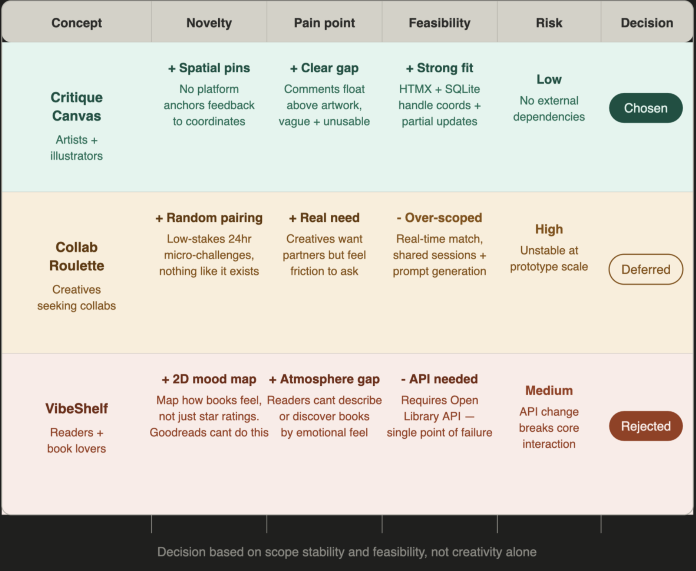
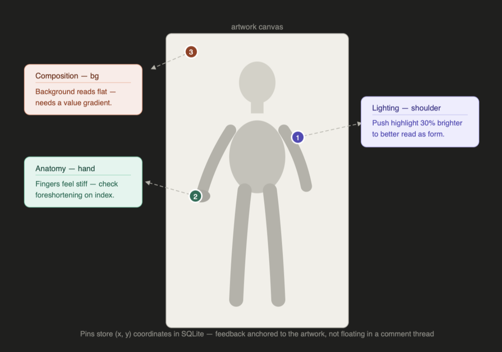

**Blog 1 ended with three finalists.** Collab Roulette,
VibeShelf, and Critique Canvas all passed the brief's
elimination criteria. This post is about the harder
decision — and what making it revealed about the community.

---

## Identifying the Real Problem

I focused on emerging artists and illustrators, a community
I personally belong to. My early assumption was that artists
need visibility and engagement. However, platforms like
Instagram and Reddit already provide this. The real issue
is not sharing work, but **what happens after**. Feedback
is often vague (*"nice colours"*) or non-specific
(*"anatomy feels off"*), making it genuinely difficult
to act on.

Before committing to this direction, I observed several
online artist communities — Reddit's r/ArtFundamentals and
r/learnart, Behance, DeviantArt, and Pinterest boards. The
pattern was identical across all of them: comments floated
below the image, disconnected from the work itself. The gap
is structural, not accidental.

Existing platforms treat feedback as text detached from the
artwork. This ignores how artists think — visually and
spatially. In real studio critique, feedback is point-based:
circling areas, drawing directly on work, pointing to
specific regions. Digital platforms flatten this into comment
threads, removing context and precision.

> The issue is not lack of feedback, but lack of
**contextual, actionable critique.**

---

## Why the Other Two Failed

**Collab Roulette** was the most exciting idea. Randomly
pairing two creatives for a 24-hour micro-challenge —
nothing like it exists. But it required real-time matching,
shared session states, and prompt generation. Together these
pointed toward an unstable prototype — ambitious on paper,
fragile in practice.

**VibeShelf** mapped how books feel to read on a 2D canvas.
Genuinely novel — Goodreads cannot replicate it. But it
depended on an external API, a single point of failure if
it rate-limits or changes.

**Critique Canvas** aligned across every criterion: clear
community pain point, no external dependencies, novel
interaction that Instagram and DeviantArt structurally
cannot offer, and direct mapping to the required stack —
coordinate storage in SQLite, inline updates via HTMX,
server-rendered templates in MojoJS.

*Figure 1: Three finalists evaluated — decision based on
scope stability and feasibility, not creativity alone.*

> The decision was not based on creativity alone, but on
**scope stability and feasibility** under real constraints.

---

## Final Direction: Critique Canvas

Critique Canvas is an **interactive feedback layer for
artwork**. Users upload an artwork; others click directly
on specific areas; each click creates a comment linked to
*(x, y) coordinates*; feedback renders as anchored
annotations; HTMX enables live updates without page reloads.
This shifts critique from general comments into **spatial,
precise feedback** embedded directly within the artwork.

*Figure 2: The core interaction — annotations anchored to
specific regions, not floating in a comment thread below.*

---

## Early Functional Requirements *(Evolving)*

**Core — must have:**
- Upload and persist artwork images
- Click-based annotation capturing coordinates
- Store annotations linked to user and artwork
- Render annotations at correct positions
- HTMX-driven inline updates

**Secondary — not load-bearing:**
Category filtering and an accessible list view would
enhance usability once the annotation loop is stable, but
neither is essential. Visual density indicators were
deprioritised entirely — they add complexity without
improving critique quality.

---

## Ambiguities and Open Questions

Several constraints remain unresolved:

- How reliably coordinates map across **responsive layouts**
- How to manage **annotation overlap** and visual clutter
- Whether mobile interaction requires a **separate pattern**
- How performance scales with **dense annotation data**

These are design constraints shaping later technical
decisions — not problems to avoid.

---

## Reflection

This process was about **elimination rather than expansion**.
Critique Canvas emerged not as the most feature-rich idea,
but as the only one satisfying the brief's core requirement:
a community-specific interaction that cannot exist on generic
platforms.

> The requirements are intentionally incomplete — the next
step is validating feasibility through data modelling,
interaction design, and implementation constraints.