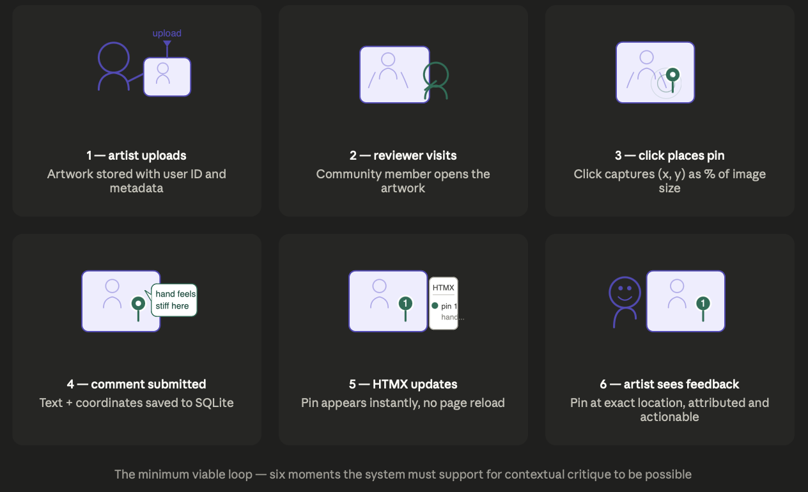
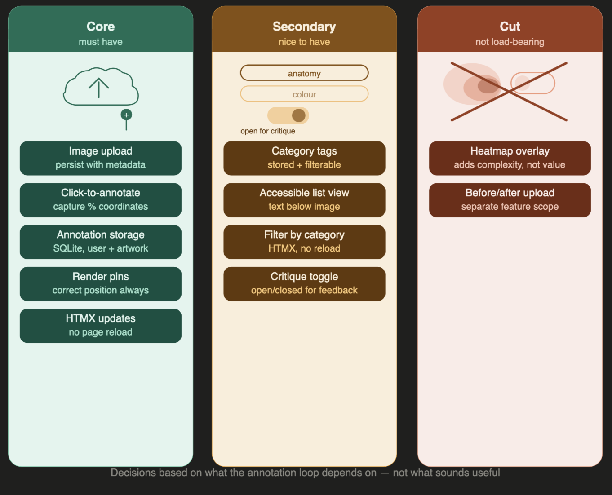
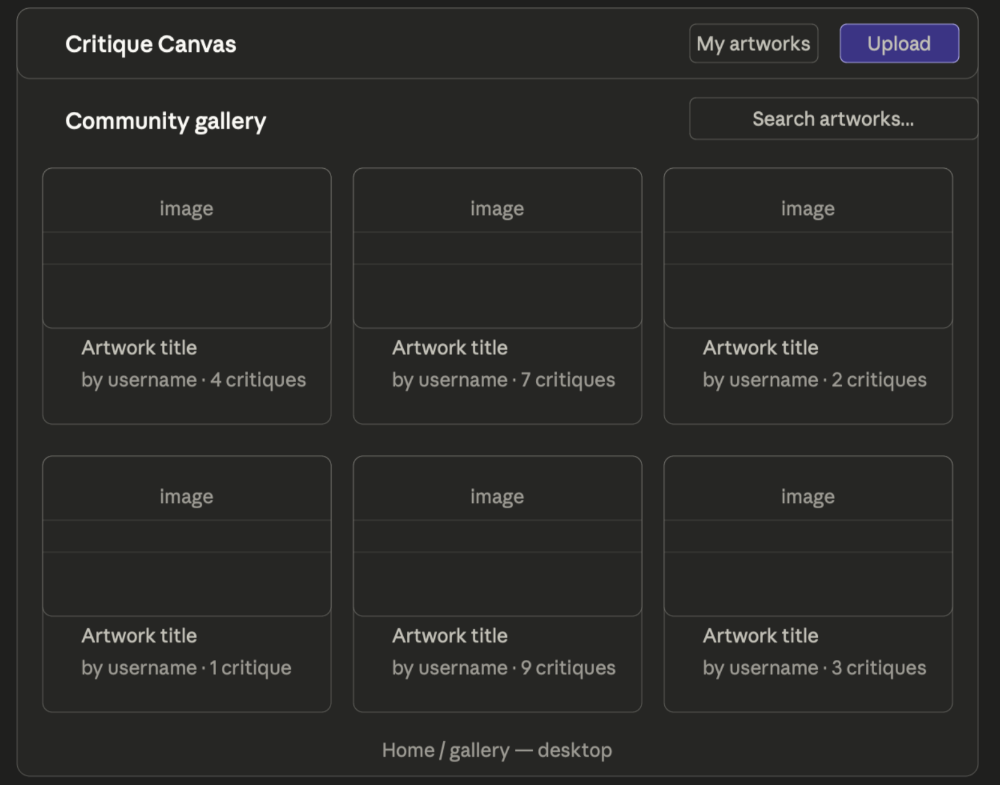
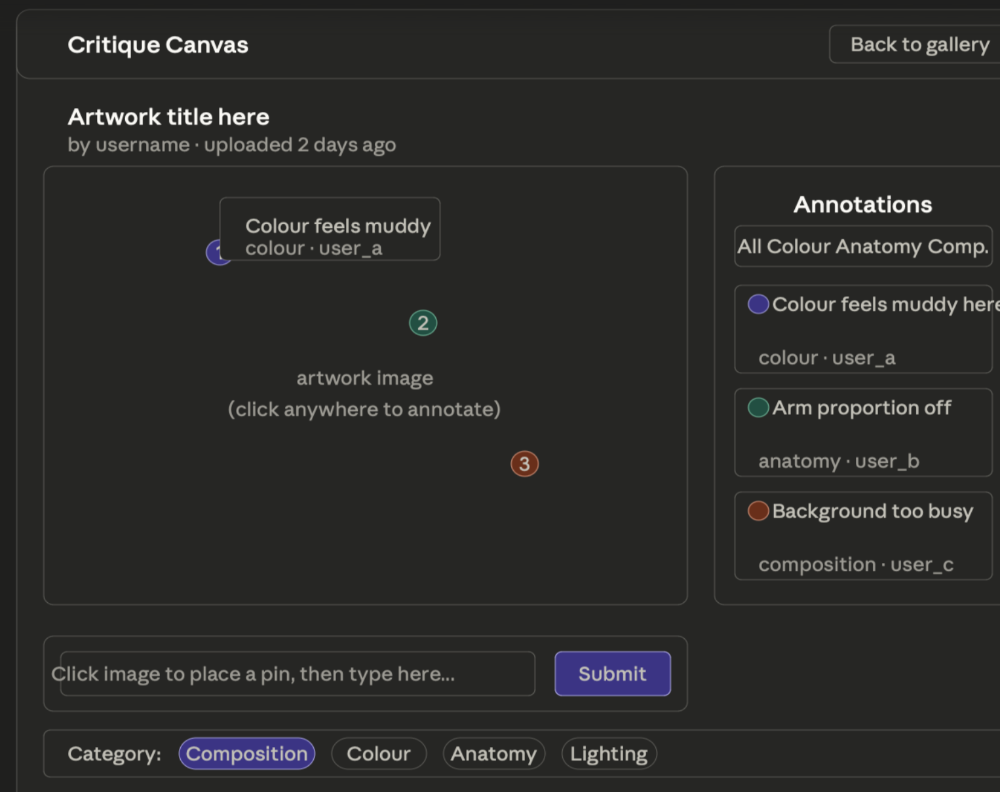
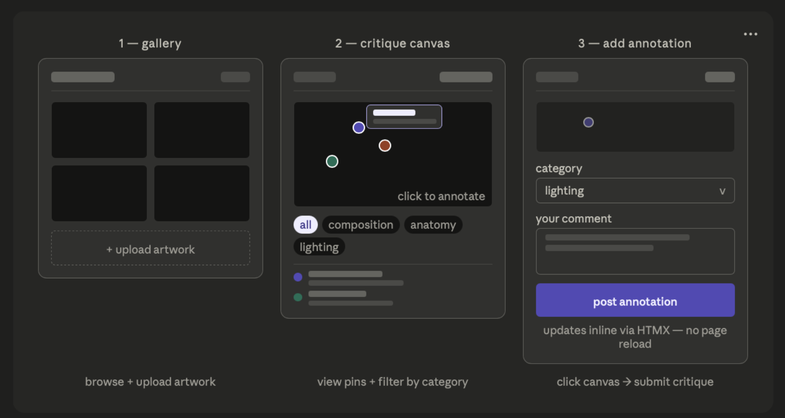

**Blog 2 ended with a deliberate gap.** The requirements were
intentionally incomplete — and that was the right call. This
post is where the concept begins shifting from an appealing
idea into concrete, testable behaviours.

The question driving this post is not *"what could this app
include?"* but **"what behaviours must exist for contextual
critique to be possible?"** That reframe kept scope disciplined.

---

## Reframing Requirements as System Behaviour

I worked backwards from one scenario: an artist uploads a
figure drawing and wants specific feedback on the anatomy of
the hands. What must the system support?

The artist uploads an image. A reviewer clicks the exact
region they are commenting on. That comment is stored against
that position. When the artist returns, the annotation appears
at the correct location, attributed to who left it.

> That is the **minimum viable loop**. Everything else is
secondary.

*Figure 1: Six moments the system must support — everything
in the requirements list exists to serve this sequence.*

Category tagging is useful — but the loop functions without
it. A heatmap adds complexity without improving critique.
These are secondary not because they are bad ideas, but
because they are **not load-bearing**.

---

## Core Functional Requirements — With Reasoning

**1. Image upload and persistent storage**
Users upload a JPEG or PNG stored with metadata — user ID,
timestamp, filename. This establishes `artwork` as the parent
object for every annotation. Without reliable persistence,
nothing else is possible.

**2. Click-to-annotate interaction**
When a user clicks the artwork, the system captures the
position and opens a comment input. Coordinates must be stored
as **percentages of the image container**, not absolute pixels
— pixel coordinates break across screen sizes; percentages
scale with the container. This is a technical decision driven
by one requirement: **spatial accuracy across devices**.

**3. Annotation storage and retrieval**
Each annotation is stored in SQLite with relationships to both
the artwork and the user session — a natural fit for a
relational model.

**4. Rendering pins at correct positions**
Pins must appear exactly where the user clicked. Incorrect
scaling causes drift and overlap, shaping both rendering logic
and the data model.

**5. HTMX-driven inline updates**
New annotations must appear without a full page reload —
because reloading resets the user's spatial view of the
artwork. HTMX partial updates preserve the canvas state while
appending the new pin.

---

## Secondary Requirements — Not Load-Bearing

- **Category tags** — stored and filterable, but not
essential to the loop
- **Accessible list view** — annotations as text below the
image; critical for keyboard and screen reader users
- **Filter by category** — HTMX-driven, depends on category
tags existing first
- **Critique toggle** — open or closed for feedback; one
boolean field in the artwork table

A heatmap overlay was cut entirely — rendering complexity
without improving critique quality. Before/after upload
comparison was also cut.

---

*Figure 2: Requirements mapped by priority — what the
annotation loop depends on, what enhances it, and what
was cut.*

---

## Early Wireframes — Requirements Made Visual

Before writing any code, we sketched the key interfaces to
test whether the requirements were buildable as described.
Each wireframe maps directly to a functional requirement.

*Figure 3: Gallery wireframe — artwork cards with critique
counts, search, upload button. Confirms the gallery needs
no complex data beyond artwork metadata.*

*Figure 4: Artwork view wireframe — annotation pins, comment
sidebar, category filter pills. Every element maps to a core
requirement from the list above.*

*Figure 5: Three-step flow — gallery to canvas to annotation
submission. HTMX labelled at the point of submit, confirming
no page reload is a design requirement not just a technical
convenience.*

---

## Responsibilities This Stage Surfaced

Critique Canvas stores user-uploaded artwork linked to session
IDs — data handling must be intentional. The brief requires
**AA accessibility compliance**, and for an annotation-heavy
interface this is a specific challenge: pins are inherently
visual, so the accessible list view is a parallel requirement
from the start, not an afterthought. For evaluation, I plan
to validate coordinate accuracy across screen sizes, test
keyboard navigation, and verify contrast ratios against
WCAG AA standards.

---

## Reflection

The requirements are tighter but not final. The wireframes
above tested buildability before any code was written — and
confirmed the core interaction is structurally sound. The
pixel-vs-percentage coordinate decision remains the clearest
technical choice grounded in a requirement. The next step
is mapping these to database schema and interaction flows.

> Requirements should constrain the build — but they should
also **change when the build reveals something the
requirements missed.**