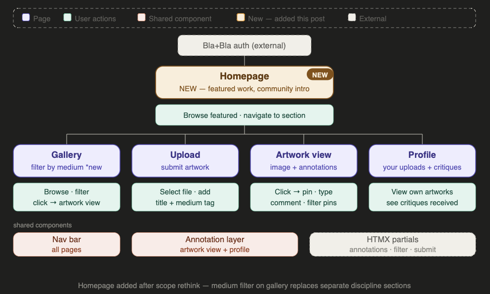
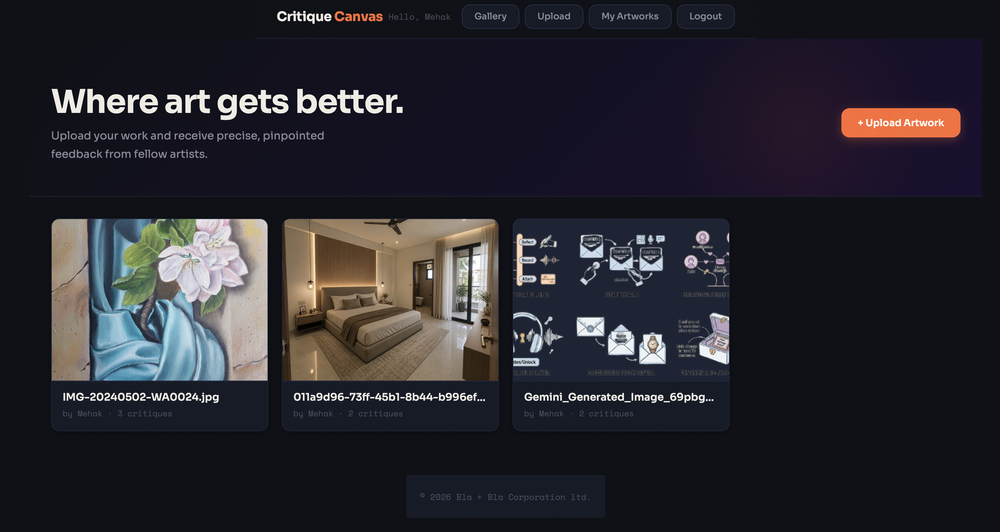
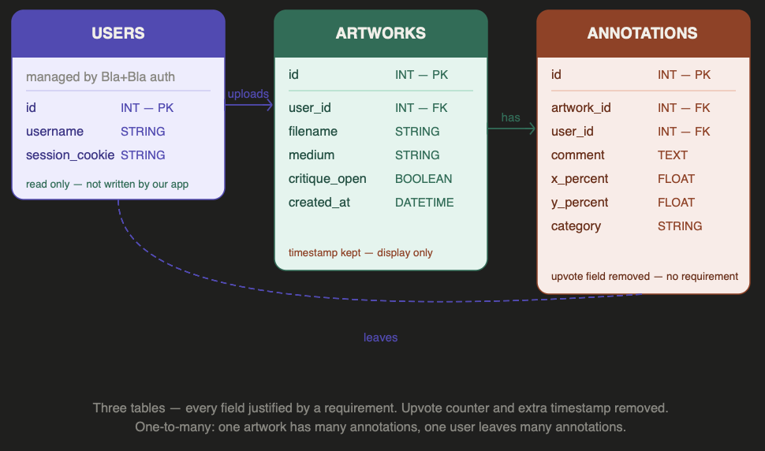
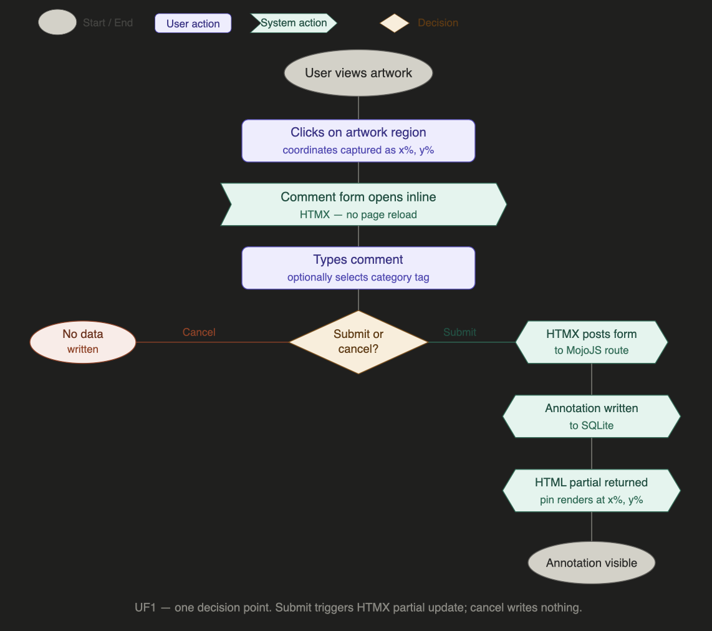
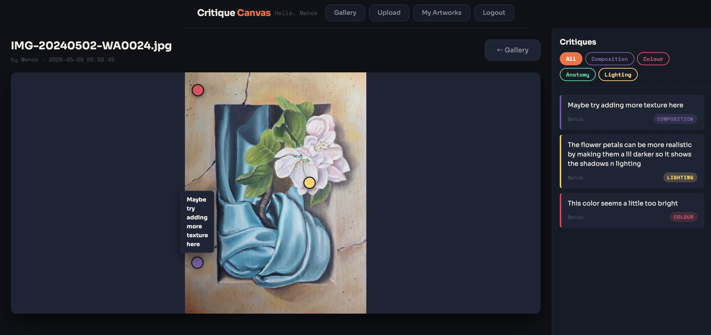

**Planning on paper is easy. The moment you try to build a
data model, requirements get tested for real.**

Blog 3 defined what the system must do. This post is about
translating that into structure — and what changed when we did.

---

## Two design decisions before the data model

**Decision 1: Medium categories, not discipline sections**

Our tutor pushed us to think more carefully about the community.
The instinct was to create separate sections for illustrators,
photographers, painters. But that would fragment a community
that shares the same core need — spatial, precise critique. A
photographer pinning "exposure is off here" to a specific area
of an image uses Critique Canvas identically to an illustrator
pinning "anatomy feels wrong here."

The solution was simpler: one `medium` field on the artwork
table. Photography, Illustration, Digital Art, Traditional Art.
One column, one gallery filter, no fragmentation. The community
stays unified; the gallery becomes navigable.

**Decision 2: Adding a homepage**

The original page structure went straight from login to gallery
— which assumed users already knew what they were doing. A
homepage was missing: somewhere that orients new members,
surfaces featured work, and makes the community feel like a
place rather than a database. This added one page to the
structure and nothing to the data model.

*Figure 1: Updated sitemap — homepage added between login
and gallery. One new page, no new database tables.*

*Figure 2: Current gallery page — hero section and artwork cards
showing, the homepage addition is planned but not yet implemented.*

---

## Building the ERD — and what it removed

Three tables support the system: `artworks`, `annotations`,
and `users`.

`artworks` stores filename, uploader user ID, timestamp, medium
category, and a boolean for the critique toggle. One artwork has
many annotations — a one-to-many relationship that SQLite
handles cleanly with a foreign key.

`annotations` stores comment text, `x_percent` and `y_percent`
as floats, an optional category tag, the artwork ID, and the
commenter's user ID. Every field connects directly to a
requirement — the percentage coordinates exist because of the
responsive accuracy decision from Blog 3.

`users` is owned by Bla+Bla auth. We read the user ID from the
session cookie but do not write to this table.

Building the ERD removed two fields that seemed obvious at
first: an annotation timestamp and a helpfulness upvote counter.
Neither could be connected to any behaviour the system must
support right now. If a field has no requirement, it has no
place in the schema.

> The ERD did not just implement the requirements — it **tested**
them. Two fields failed that test and were cut.

*Figure 3: ERD — three tables, every field justified by a
functional requirement. Upvote counter removed, timestamp
kept for display only.*

---

## Mapping the annotation flow

With the data model confirmed, the annotation user flow maps
cleanly. User clicks the artwork — coordinates captured. Comment
form appears inline via HTMX — no reload. User submits — MojoJS
route receives the data, writes to SQLite, returns an HTML
partial. HTMX swaps the partial into the page. Pin appears at
the correct position. If the user cancels, nothing is written.

One genuine decision point: submit or cancel. That simplicity
is reassuring — the core interaction is stable enough to build
on confidently.

*Figure 4: UF1 — one decision point, two paths. HTMX partial
update fires on submit, preserving the spatial view.*

---

## Where things stand

The annotation table is live. Coordinates are storing correctly.
The HTMX partial is returning pins without page reload.

*Figure 5: The annotation layer live — three pins anchored
to specific regions of a painting, comment sidebar showing
real critique with category tags. Percentage-based coordinates
rendering correctly in the browser.*

The open question from Blog 3 — whether percentage-based
coordinates hold across screen sizes — is now being tested.
Early results are promising but not yet confirmed across all
viewports.

> The next step is the hardest: not building new features, but
making sure what exists is **stable, accessible, and correct**
before anything else is added.