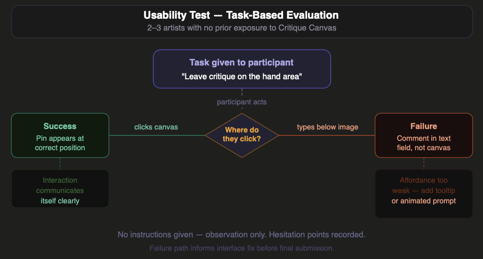
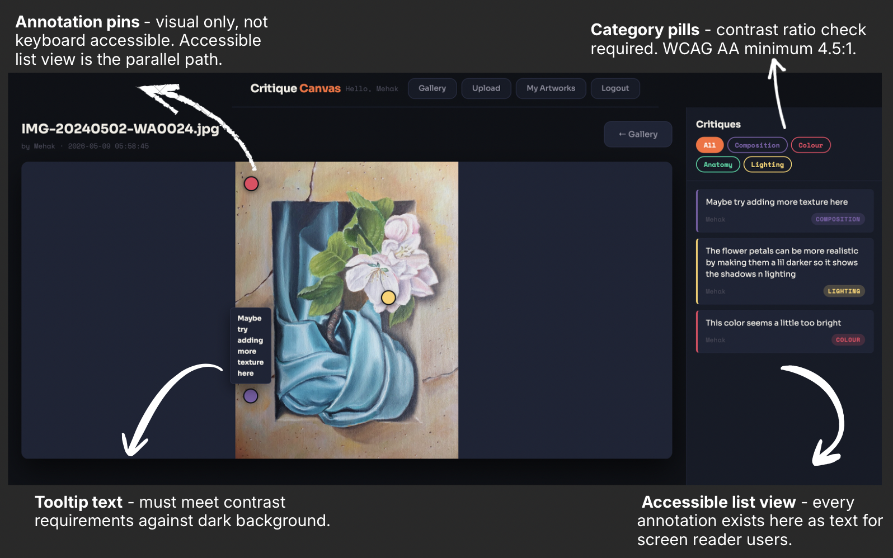
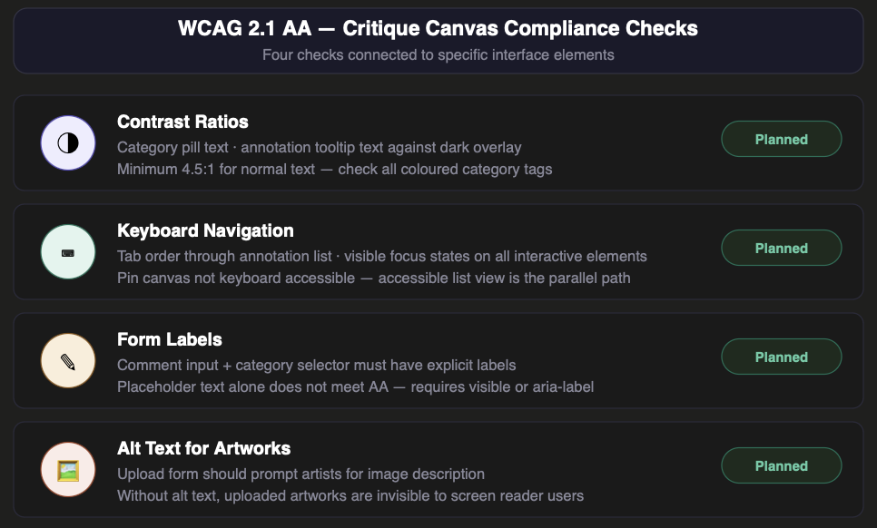
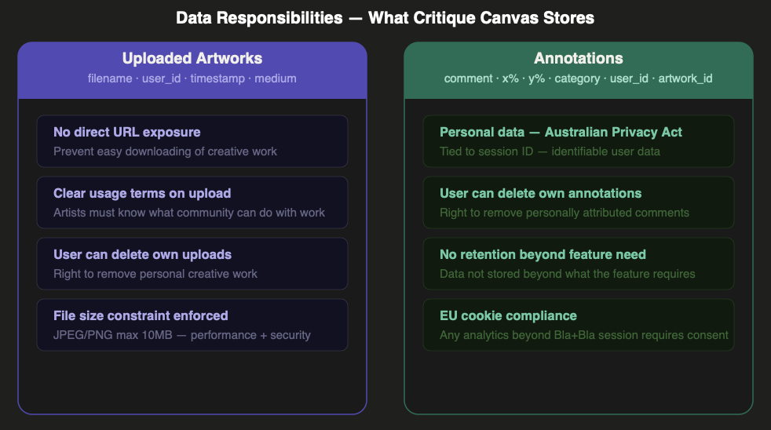
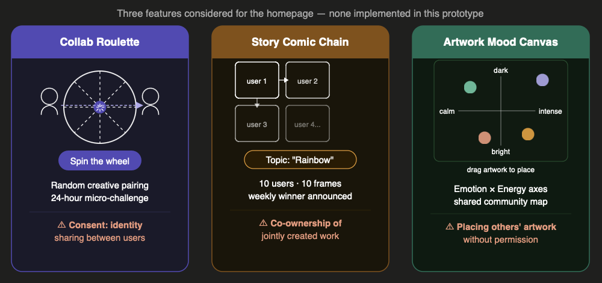

**Stability is not the same as correctness.** Blog 5 ended
with the prototype stable. This post asks a harder question:
does it work correctly for every user — not just those who
use it as expected?

---

## Evaluating usability

The core interaction — clicking an artwork to leave a pinned
annotation — is spatially unusual, a genuine usability risk.

I would run a task-based test with two or three artists
unfamiliar with Critique Canvas. Task: leave a critique on a
specific area. No instructions given. I would observe where
they hesitate and whether they find the annotation without
prompting.

The failure I am watching for: users who type in the text
field below instead of clicking the canvas. To mitigate this,
a helper prompt was added: *"Click anywhere on the artwork
to leave a pin."* Additional implementations include a cookie
consent banner, a skip link for keyboard navigation, and
visible focus styles on all interactive elements. Whether
these are sufficient will be confirmed through the test.

*Figure 1: Task-based test — success and failure paths,
with interface fix identified.*

For performance, the brief requires load times under three
seconds. The main risk is uncompressed image uploads. I would
test using browser developer tools across artworks of varying
file sizes.

---

## Accessibility — specific to this interface

The brief requires AA compliance. For Critique Canvas this
has a specific implication: pins are inherently visual and
pointer-dependent. A keyboard user cannot click a coordinate.

This is why the accessible list view is not optional — it is
a parallel interface. Every pin must exist as text below the
artwork, attributed to category and author. A screen reader
user should access every annotation without needing the canvas.

WCAG 2.1 AA checks implemented and planned:

- **Contrast ratios** — category pills, tooltip text against dark overlay
- **Keyboard navigation** — tab order through annotation list, visible focus states
- **Form labels** — comment input needs explicit labels, not placeholder text only
- **Alt text** — upload form prompts artists for image description
- **Skip link** — appears on Tab press, jumps to main content
- **Cookie consent** — dismissable banner, screen reader accessible with aria-live

*Figure 2: Accessibility mapped to the real interface.*

*Figure 3: Four WCAG AA checks mapped to specific interface elements.*

---

## Responsibility and data

Critique Canvas stores two categories of user content —
uploaded artworks and annotations — each with different
responsibilities.

Artworks are personal creative work. Artists have not
consented to redistribution. Image serving should route
through authenticated endpoints rather than exposing direct
file URLs. The upload flow should include clear terms stating
work is shared within the community only.

Annotations are tied to session IDs — personal data under
Australian Privacy Act principles and GDPR where users access
from the EU. Users should be able to delete their own
annotations, and data should not be retained beyond feature
need. The EU cookie compliance requirement is addressed
through a dismissable consent banner before any non-essential
tracking.

*Figure 4: Two data categories treated separately
with different obligations.*

Three secondary features under consideration each introduce
responsibility questions that require answers before launch.
Collab Roulette raises consent questions around identity
sharing between paired users. The collaborative comic chain
raises co-ownership questions over jointly created work. The
artwork mood canvas raises questions around placing others'
artwork without explicit permission. These are not blockers -
they are design decisions that need answers before features
ship.

*Figure 5: Three features considered for the homepage —
each with a specific responsibility concern to resolve
before implementation.*

---

## Reflection

Looking back across all six blogs, the concept held. The
requirements from Blog 3 drove the data model in Blog 4,
which informed the stack decisions in Blog 5. This post
reveals that the accessible list view was never optional -
it should have been framed as a core requirement from the
start. Building responsibly meant returning to earlier
decisions and asking whether they held up.

> Good design is not just functional and usable. It is
**responsible by default** — not patched for compliance
at the end.